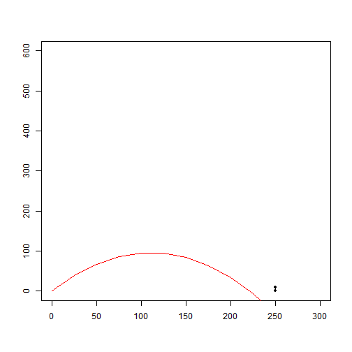

## Agenda
# Instead of doing boring statistics - let's keep with the Dennis Ritchie tradition and learn by playing

1. Can you play with Shiny?
2. Is it hard?
3. Ok - let's play!plot(9,1100,30)

--- .class #id 

1.  Well - there's no game framework
2.  The graphics are nice for statistics, but not for first person shooters
3.  But don't ket that stop you!

---
## Is it Hard?

1.  Well - the reactive flow is a bit odd
2.  My physics could use some updating
3.  But don't let that stop you!

---
## Ok - Let's Play Hit the Target!

https://zumbydodah.shinyapps.io/Shiny/

 
